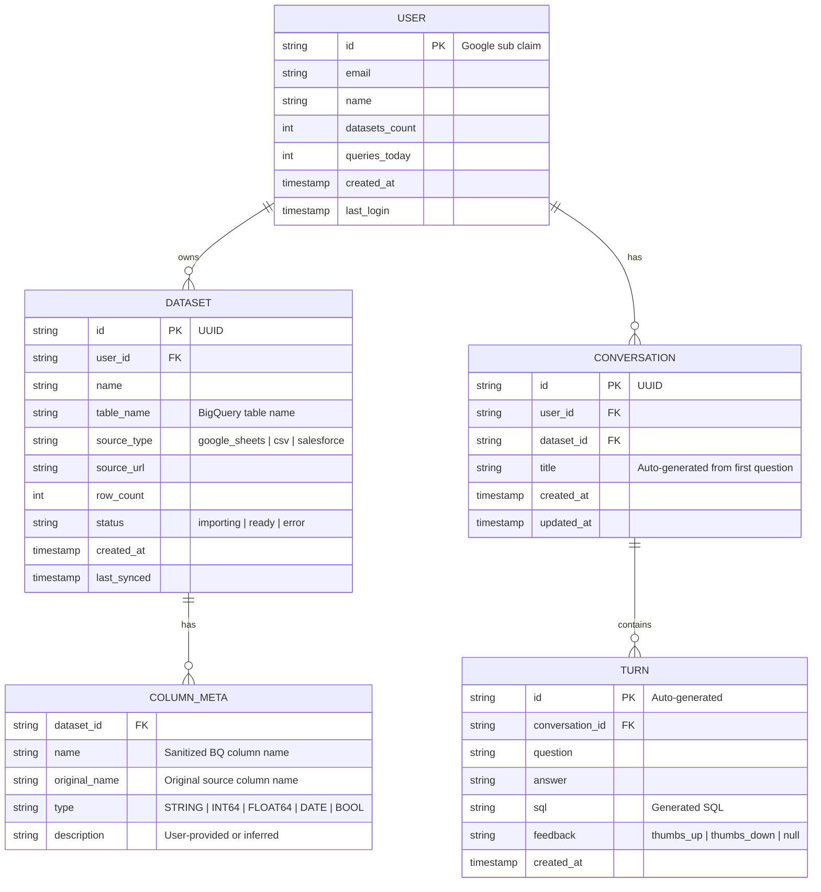

# Talk2MyData - AI-Powered Data Chatbot Platform

## Overview

Talk2MyData is a production-grade, domain-agnostic application that lets users connect any data source (starting with Google Sheets), automatically ingest and store the data in BigQuery, and then ask natural language questions via a chat interface powered by Google Gemini AI. The system converts questions to SQL, executes them against BigQuery, and returns formatted answers with tables, charts, and natural language explanations.

The UI matches the CloudERPSuites brand theme (professional enterprise B2B aesthetic with blue/dark tones) and the architecture is designed with a pluggable connector system to support Salesforce, NetSuite, CSV uploads, and any future data source.

## Architecture

```
+─────────────────────+      +─────────────────────+      +─────────────────────+
│   Next.js Frontend  │      │   FastAPI Backend    │      │   Google Cloud      │
│   (Cloud Run)       │      │   (Cloud Run)        │      │                     │
│                     │      │                     │      │                     │
│ - Chat UI (useChat) │─────>│ /api/v1/query/ask   │─────>│ Gemini 2.5 Flash    │
│ - Dataset Manager   │      │   (SSE streaming)   │      │   (text-to-SQL)     │
│ - Data Viz (Recharts│      │                     │      │                     │
│ - Google Sign-In    │<─────│ QueryService        │─────>│ BigQuery            │
│                     │      │   - SQL Generator   │      │   (query execution) │
│ Connector Config UI │─────>│ /api/v1/connectors  │      │                     │
│                     │      │   ConnectorService   │─────>│ Sheets API v4       │
│                     │      │   - Registry        │      │   (data ingestion)  │
│                     │      │   - Adapters        │      │                     │
│                     │      │                     │      │ Firestore           │
│                     │      │ /api/v1/datasets    │─────>│   (metadata store)  │
│                     │      │ /api/v1/auth        │      │                     │
│                     │      │   (Google ID token)  │      │ Secret Manager      │
+─────────────────────+      +─────────────────────+      +─────────────────────+
```

### Data Flow

```
Google Sheets (source)
    │
    ▼
gspread reads into Pandas DataFrames
    │
    ▼
Schema inference (type detection, column sanitization)
    │
    ▼
BigQuery load_table_from_dataframe (per-user dataset isolation)
    │
    ▼
User asks question in chat
    │
    ▼
Gemini 2.5 Flash generates SQL (with schema context + conversation history)
    │
    ▼
SQL validation (sqlglot parse → safety check → BigQuery dry-run)
    │
    ▼
BigQuery executes validated SQL
    │
    ▼
Gemini formats results as natural language + suggests visualization
    │
    ▼
SSE stream back to Next.js → renders text + table + chart
```

## Technical Decisions

| Decision | Choice | Rationale |
|----------|--------|-----------|
| Frontend | Next.js 15 + React + Tailwind + shadcn/ui | Modern, production-ready, excellent streaming support via Vercel AI SDK |
| Backend | Python FastAPI | Best ecosystem for AI/ML, Gemini SDK, data processing (pandas), async support |
| Database (analytics) | Google BigQuery | Purpose-built for analytical queries, perfect for text-to-SQL use cases |
| Database (metadata) | Google Firestore | Serverless, real-time, ideal for user profiles, dataset registry, conversation history |
| AI Model | Gemini 2.5 Flash | Best price/performance for SQL generation (251 tok/s, $0.30/1M input tokens) |
| AI SDK | `google-genai` (NOT deprecated Vertex AI SDK) | Official recommended SDK as of 2026 |
| Auth | Google Sign-In → ID token validation in FastAPI | Leverages Google ecosystem, single sign-on |
| Deployment | Google Cloud Run (both frontend + backend) | Containerized, auto-scaling, pay-per-use |
| Secrets | Google Secret Manager | Secure, rotatable, IAM-controlled |
| Sheets access | OAuth with `spreadsheets.readonly` scope | Better UX than service account sharing |
| Data isolation | Separate BigQuery dataset per user | Strongest isolation, prevents cross-user data leaks |
| SQL safety | Read-only IAM role + SQL parsing (SELECT only) + dry-run validation | Defense in depth |
| Streaming | SSE (Server-Sent Events) with Vercel AI SDK data stream protocol | Real-time token streaming, compatible with useChat |
| Charts | Recharts | React-native, declarative, well-maintained |
| Connector pattern | Hexagonal architecture (ports & adapters) with registry | Pluggable, extensible to any data source |

## Project Structure

```
talk2mydata/
├── frontend/                          # Next.js application
│   ├── app/
│   │   ├── layout.tsx                 # Root layout with theme + auth provider
│   │   ├── page.tsx                   # Landing page
│   │   ├── (auth)/
│   │   │   ├── login/page.tsx         # Google Sign-In page
│   │   │   └── callback/page.tsx      # OAuth callback handler
│   │   ├── (app)/
│   │   │   ├── layout.tsx             # App shell (sidebar + header)
│   │   │   ├── dashboard/page.tsx     # Dataset list + connect new
│   │   │   ├── chat/[datasetId]/
│   │   │   │   └── page.tsx           # Chat interface for a dataset
│   │   │   └── settings/page.tsx      # User settings
│   │   └── api/
│   │       └── chat/route.ts          # Proxy to FastAPI (SSE passthrough)
│   ├── components/
│   │   ├── ui/                        # shadcn/ui components
│   │   ├── chat/
│   │   │   ├── message-list.tsx       # Message thread display
│   │   │   ├── chat-input.tsx         # Input with send button
│   │   │   ├── data-table.tsx         # Query result table
│   │   │   ├── chart-renderer.tsx     # Dynamic chart rendering
│   │   │   ├── sql-viewer.tsx         # Expandable SQL display
│   │   │   └── loading-states.tsx     # Skeleton loaders, typing indicator
│   │   ├── connectors/
│   │   │   ├── connect-dialog.tsx     # URL input + sheet selector
│   │   │   ├── ingestion-progress.tsx # Progress bar during import
│   │   │   └── dataset-card.tsx       # Dataset card on dashboard
│   │   └── layout/
│   │       ├── header.tsx             # Top nav with user avatar
│   │       ├── sidebar.tsx            # Dataset list sidebar
│   │       └── theme-provider.tsx     # CloudERPSuites brand theme
│   ├── lib/
│   │   ├── api-client.ts             # Typed fetch wrapper for FastAPI
│   │   ├── auth.ts                   # Google Sign-In helpers
│   │   └── utils.ts                  # Shared utilities
│   ├── tailwind.config.ts
│   ├── next.config.ts
│   ├── Dockerfile
│   └── package.json
│
├── backend/                           # FastAPI application
│   ├── app/
│   │   ├── main.py                   # App factory, lifespan, middleware
│   │   ├── config.py                 # Pydantic Settings (env vars)
│   │   ├── dependencies.py           # Shared DI providers (BQ client, etc.)
│   │   ├── middleware/
│   │   │   ├── __init__.py
│   │   │   ├── auth.py               # Google ID token validation middleware
│   │   │   ├── cors.py               # CORS configuration
│   │   │   ├── request_id.py         # Request ID injection
│   │   │   └── error_handler.py      # Global error handler
│   │   ├── auth/
│   │   │   ├── router.py             # /api/v1/auth endpoints
│   │   │   ├── schemas.py            # Auth request/response models
│   │   │   └── service.py            # Token validation, user creation
│   │   ├── connectors/
│   │   │   ├── router.py             # /api/v1/connectors endpoints
│   │   │   ├── schemas.py            # Connector request/response models
│   │   │   ├── service.py            # Orchestration (connect → ingest → store)
│   │   │   ├── ports.py              # Abstract DataConnector interface
│   │   │   ├── registry.py           # Connector plugin registry
│   │   │   └── adapters/
│   │   │       ├── __init__.py
│   │   │       ├── google_sheets.py  # Google Sheets adapter
│   │   │       ├── csv_upload.py     # CSV/Excel file adapter (future)
│   │   │       ├── salesforce.py     # Salesforce adapter (stub)
│   │   │       └── netsuite.py       # NetSuite adapter (stub)
│   │   ├── query/
│   │   │   ├── router.py             # /api/v1/query endpoints
│   │   │   ├── schemas.py            # Query request/response models
│   │   │   ├── service.py            # Orchestration (question → SQL → execute → format)
│   │   │   ├── sql_generator.py      # Gemini text-to-SQL with CoT prompting
│   │   │   ├── sql_validator.py      # Multi-stage SQL validation
│   │   │   └── result_formatter.py   # Format results + chart suggestions
│   │   ├── datasets/
│   │   │   ├── router.py             # /api/v1/datasets endpoints
│   │   │   ├── schemas.py            # Dataset request/response models
│   │   │   ├── service.py            # Dataset CRUD, schema management
│   │   │   └── schema_inference.py   # DataFrame → BigQuery schema inference
│   │   └── common/
│   │       ├── bigquery_client.py    # BigQuery wrapper
│   │       ├── firestore_client.py   # Firestore wrapper
│   │       ├── gemini_client.py      # google-genai wrapper
│   │       └── exceptions.py         # Custom exception classes
│   ├── tests/
│   │   ├── conftest.py
│   │   ├── test_connectors/
│   │   ├── test_query/
│   │   └── test_datasets/
│   ├── Dockerfile
│   └── requirements.txt
│
├── docs/
│   └── plans/
│       └── (this file)
├── docker-compose.yml                 # Local development
└── README.md
```

## Implementation Phases

---

### Phase 1: Foundation & Infrastructure (Days 1-3)

**Goal:** Project scaffolding, authentication, and deployment pipeline working end-to-end.

#### 1.1 Backend Scaffolding

**File: `backend/app/main.py`**

```python
from contextlib import asynccontextmanager
from fastapi import FastAPI
from fastapi.middleware.cors import CORSMiddleware
from google.cloud import bigquery, firestore
from google import genai

from app.config import settings
from app.middleware.auth import AuthMiddleware
from app.middleware.request_id import RequestIdMiddleware
from app.middleware.error_handler import GlobalErrorMiddleware

@asynccontextmanager
async def lifespan(app: FastAPI):
    # Startup: initialize shared clients
    app.state.bq_client = bigquery.Client(project=settings.GCP_PROJECT)
    app.state.firestore_client = firestore.AsyncClient(project=settings.GCP_PROJECT)
    app.state.genai_client = genai.Client(api_key=settings.GEMINI_API_KEY)
    yield
    # Shutdown
    app.state.bq_client.close()

def create_app() -> FastAPI:
    app = FastAPI(title="Talk2MyData API", version="1.0.0", lifespan=lifespan)

    app.add_middleware(GlobalErrorMiddleware)
    app.add_middleware(AuthMiddleware)
    app.add_middleware(RequestIdMiddleware)
    app.add_middleware(
        CORSMiddleware,
        allow_origins=settings.CORS_ORIGINS,
        allow_credentials=True,
        allow_methods=["GET", "POST", "DELETE", "OPTIONS"],
        allow_headers=["Content-Type", "Authorization"],
    )

    from app.auth.router import router as auth_router
    from app.connectors.router import router as connectors_router
    from app.query.router import router as query_router
    from app.datasets.router import router as datasets_router

    app.include_router(auth_router, prefix="/api/v1/auth", tags=["auth"])
    app.include_router(connectors_router, prefix="/api/v1/connectors", tags=["connectors"])
    app.include_router(query_router, prefix="/api/v1/query", tags=["query"])
    app.include_router(datasets_router, prefix="/api/v1/datasets", tags=["datasets"])

    return app

app = create_app()
```

**File: `backend/app/config.py`**

```python
from pydantic_settings import BaseSettings

class Settings(BaseSettings):
    GCP_PROJECT: str
    GCP_LOCATION: str = "us-central1"
    GEMINI_API_KEY: str
    CORS_ORIGINS: list[str] = ["http://localhost:3000"]
    ALLOWED_HOSTS: list[str] = ["*"]
    BQ_DATASET_PREFIX: str = "t2md_user_"
    MAX_ROWS_PER_IMPORT: int = 100_000
    MAX_COLUMNS_PER_IMPORT: int = 200
    MAX_DATASETS_PER_USER: int = 5
    MAX_QUERY_BYTES_SCANNED: int = 1_073_741_824  # 1 GB
    MAX_QUERIES_PER_DAY: int = 100
    CONVERSATION_CONTEXT_TURNS: int = 10
    CONVERSATION_RETENTION_DAYS: int = 90

    class Config:
        env_file = ".env"

settings = Settings()
```

#### 1.2 Authentication

**File: `backend/app/middleware/auth.py`**

```python
from starlette.middleware.base import BaseHTTPMiddleware
from starlette.requests import Request
from starlette.responses import JSONResponse
from google.oauth2 import id_token
from google.auth.transport import requests as google_requests

PUBLIC_PATHS = {"/health", "/docs", "/openapi.json"}

class AuthMiddleware(BaseHTTPMiddleware):
    async def dispatch(self, request: Request, call_next):
        if request.url.path in PUBLIC_PATHS or request.method == "OPTIONS":
            return await call_next(request)

        auth_header = request.headers.get("Authorization", "")
        if not auth_header.startswith("Bearer "):
            return JSONResponse(status_code=401, content={"error": "Missing token"})

        token = auth_header.removeprefix("Bearer ")
        try:
            idinfo = id_token.verify_oauth2_token(
                token, google_requests.Request()
            )
            request.state.user_id = idinfo["sub"]
            request.state.user_email = idinfo["email"]
            request.state.user_name = idinfo.get("name", "")
        except ValueError:
            return JSONResponse(status_code=401, content={"error": "Invalid token"})

        return await call_next(request)
```

**File: `backend/app/auth/service.py`**

```python
from google.cloud.firestore import AsyncClient

class AuthService:
    def __init__(self, db: AsyncClient):
        self.db = db

    async def ensure_user_exists(self, user_id: str, email: str, name: str) -> dict:
        user_ref = self.db.collection("users").document(user_id)
        user_doc = await user_ref.get()

        if not user_doc.exists:
            user_data = {
                "email": email,
                "name": name,
                "created_at": firestore.SERVER_TIMESTAMP,
                "datasets_count": 0,
                "queries_today": 0,
            }
            await user_ref.set(user_data)
            return user_data

        return user_doc.to_dict()
```

#### 1.3 Frontend Scaffolding

```bash
npx create-next-app@latest frontend --typescript --tailwind --eslint --app --src-dir=false
cd frontend
npx shadcn@latest init
npm install ai @ai-sdk/react recharts @tanstack/react-query
npm install @react-oauth/google
```

**File: `frontend/app/layout.tsx`**

```tsx
import type { Metadata } from "next";
import { Inter } from "next/font/google";
import { GoogleOAuthProvider } from "@react-oauth/google";
import { QueryClient, QueryClientProvider } from "@tanstack/react-query";
import { ThemeProvider } from "@/components/layout/theme-provider";
import "./globals.css";

const inter = Inter({ subsets: ["latin"] });

export const metadata: Metadata = {
  title: "Talk2MyData - Ask Your Data Anything",
  description: "Connect any data source and ask questions in plain English",
};

export default function RootLayout({ children }: { children: React.ReactNode }) {
  return (
    <html lang="en" suppressHydrationWarning>
      <body className={inter.className}>
        <GoogleOAuthProvider clientId={process.env.NEXT_PUBLIC_GOOGLE_CLIENT_ID!}>
          <ThemeProvider>
            {children}
          </ThemeProvider>
        </GoogleOAuthProvider>
      </body>
    </html>
  );
}
```

**Brand Theme (CloudERPSuites-aligned):**

```css
/* frontend/app/globals.css - brand colors */
@layer base {
  :root {
    --primary: 220 70% 45%;       /* Professional blue */
    --primary-foreground: 0 0% 100%;
    --secondary: 220 15% 96%;
    --accent: 200 80% 50%;        /* Accent blue */
    --background: 0 0% 100%;
    --foreground: 222 47% 11%;
    --muted: 220 15% 96%;
    --muted-foreground: 220 10% 46%;
    --card: 0 0% 100%;
    --border: 220 13% 91%;
    --destructive: 0 84% 60%;
  }
  .dark {
    --primary: 217 91% 60%;
    --background: 222 47% 11%;
    --foreground: 210 40% 98%;
    --card: 222 47% 15%;
    --border: 217 33% 25%;
    --muted: 217 33% 18%;
    --muted-foreground: 215 20% 65%;
  }
}
```

#### 1.4 Docker & Deployment

**File: `backend/Dockerfile`**

```dockerfile
FROM python:3.12-slim
WORKDIR /app
RUN apt-get update && apt-get install -y --no-install-recommends build-essential && rm -rf /var/lib/apt/lists/*
COPY requirements.txt .
RUN pip install --no-cache-dir -r requirements.txt
COPY . .
ENV PORT=8080
CMD exec gunicorn app.main:app -w 2 -k uvicorn.workers.UvicornWorker --bind :${PORT} --max-requests 1000 --max-requests-jitter 100 --timeout 300 --access-logfile - --error-logfile -
```

**File: `frontend/Dockerfile`**

```dockerfile
FROM node:20-alpine AS builder
WORKDIR /app
COPY package*.json ./
RUN npm ci
COPY . .
ARG NEXT_PUBLIC_API_URL
ARG NEXT_PUBLIC_GOOGLE_CLIENT_ID
RUN npm run build

FROM node:20-alpine AS runner
WORKDIR /app
ENV NODE_ENV=production
COPY --from=builder /app/.next/standalone ./
COPY --from=builder /app/.next/static ./.next/static
COPY --from=builder /app/public ./public
ENV PORT=3000
CMD ["node", "server.js"]
```

**File: `docker-compose.yml`**

```yaml
services:
  backend:
    build: ./backend
    ports:
      - "8080:8080"
    env_file: ./backend/.env
    environment:
      - CORS_ORIGINS=["http://localhost:3000"]
    volumes:
      - ./backend:/app
    command: uvicorn app.main:app --host 0.0.0.0 --port 8080 --reload

  frontend:
    build:
      context: ./frontend
      args:
        NEXT_PUBLIC_API_URL: http://localhost:8080
        NEXT_PUBLIC_GOOGLE_CLIENT_ID: ${GOOGLE_CLIENT_ID}
    ports:
      - "3000:3000"
    environment:
      - NEXT_PUBLIC_API_URL=http://localhost:8080
    volumes:
      - ./frontend:/app
      - /app/node_modules
    command: npm run dev
```

#### Phase 1 Acceptance Criteria

- [x] FastAPI backend starts, `/health` returns 200
- [x] Google Sign-In works on frontend, ID token sent to backend
- [x] Auth middleware validates tokens and rejects invalid ones
- [x] User record created in Firestore on first login
- [x] Both containers deploy to Cloud Run via `gcloud run deploy`
- [x] CORS configured correctly between frontend and backend

---

### Phase 2: Data Connectors & Ingestion (Days 4-7)

**Goal:** User can paste a Google Sheets URL and have data loaded into BigQuery.

#### 2.1 Connector Architecture (Hexagonal - Ports & Adapters)

**File: `backend/app/connectors/ports.py`**

```python
from abc import ABC, abstractmethod
from dataclasses import dataclass
from typing import AsyncIterator
import pandas as pd

@dataclass
class ConnectorConfig:
    name: str
    connector_type: str       # "google_sheets", "csv", "salesforce", etc.
    credentials: dict
    settings: dict

@dataclass
class DatasetInfo:
    id: str
    name: str
    description: str
    row_count: int | None
    columns: list[dict]       # [{"name": "...", "type": "...", "description": "..."}]

class DataConnector(ABC):
    @abstractmethod
    async def test_connection(self) -> bool: ...

    @abstractmethod
    async def discover_datasets(self) -> list[DatasetInfo]: ...

    @abstractmethod
    async def extract_data(self, dataset_id: str) -> AsyncIterator[pd.DataFrame]: ...

    @abstractmethod
    async def get_schema(self, dataset_id: str) -> list[dict]: ...
```

**File: `backend/app/connectors/registry.py`**

```python
from typing import Type
from app.connectors.ports import DataConnector, ConnectorConfig

class ConnectorRegistry:
    _connectors: dict[str, Type[DataConnector]] = {}

    @classmethod
    def register(cls, connector_type: str):
        def decorator(connector_cls: Type[DataConnector]):
            cls._connectors[connector_type] = connector_cls
            return connector_cls
        return decorator

    @classmethod
    def get_connector(cls, config: ConnectorConfig) -> DataConnector:
        connector_cls = cls._connectors.get(config.connector_type)
        if not connector_cls:
            raise ValueError(f"Unknown connector: {config.connector_type}. Available: {list(cls._connectors.keys())}")
        return connector_cls(config)

    @classmethod
    def list_available(cls) -> list[str]:
        return list(cls._connectors.keys())
```

**File: `backend/app/connectors/adapters/google_sheets.py`**

```python
import re
import gspread
import pandas as pd
from typing import AsyncIterator
from google.oauth2.credentials import Credentials
from app.connectors.ports import DataConnector, ConnectorConfig, DatasetInfo
from app.connectors.registry import ConnectorRegistry

@ConnectorRegistry.register("google_sheets")
class GoogleSheetsConnector(DataConnector):
    def __init__(self, config: ConnectorConfig):
        self.config = config
        self.spreadsheet_id = self._extract_spreadsheet_id(config.settings["url"])
        self._client: gspread.Client | None = None

    @staticmethod
    def _extract_spreadsheet_id(url: str) -> str:
        match = re.search(r"/spreadsheets/d/([a-zA-Z0-9-_]+)", url)
        if not match:
            raise ValueError(f"Invalid Google Sheets URL: {url}")
        return match.group(1)

    def _get_client(self) -> gspread.Client:
        if self._client is None:
            creds = Credentials(
                token=self.config.credentials["access_token"],
                refresh_token=self.config.credentials.get("refresh_token"),
                token_uri="https://oauth2.googleapis.com/token",
                client_id=self.config.credentials["client_id"],
                client_secret=self.config.credentials["client_secret"],
                scopes=["https://www.googleapis.com/auth/spreadsheets.readonly"],
            )
            self._client = gspread.authorize(creds)
        return self._client

    async def test_connection(self) -> bool:
        try:
            client = self._get_client()
            client.open_by_key(self.spreadsheet_id)
            return True
        except gspread.exceptions.APIError:
            return False

    async def discover_datasets(self) -> list[DatasetInfo]:
        client = self._get_client()
        spreadsheet = client.open_by_key(self.spreadsheet_id)
        datasets = []
        for worksheet in spreadsheet.worksheets():
            datasets.append(DatasetInfo(
                id=worksheet.title,
                name=worksheet.title,
                description=f"Sheet '{worksheet.title}' in '{spreadsheet.title}'",
                row_count=max(0, worksheet.row_count - 1),
                columns=[],
            ))
        return datasets

    async def extract_data(self, dataset_id: str) -> AsyncIterator[pd.DataFrame]:
        client = self._get_client()
        spreadsheet = client.open_by_key(self.spreadsheet_id)
        worksheet = spreadsheet.worksheet(dataset_id)
        all_values = worksheet.get_all_values()
        if len(all_values) < 2:
            return
        headers = all_values[0]
        chunk_size = 10_000
        for i in range(1, len(all_values), chunk_size):
            chunk = all_values[i:i + chunk_size]
            yield pd.DataFrame(chunk, columns=headers)

    async def get_schema(self, dataset_id: str) -> list[dict]:
        client = self._get_client()
        spreadsheet = client.open_by_key(self.spreadsheet_id)
        worksheet = spreadsheet.worksheet(dataset_id)
        headers = worksheet.row_values(1)
        return [{"name": h, "type": "STRING", "description": ""} for h in headers]
```

#### 2.2 Schema Inference Engine

**File: `backend/app/datasets/schema_inference.py`**

```python
import re
import pandas as pd
from google.cloud import bigquery

DATE_PATTERNS = [
    (r"^\d{4}-\d{2}-\d{2}$", bigquery.enums.SqlTypeNames.DATE),
    (r"^\d{2}/\d{2}/\d{4}$", bigquery.enums.SqlTypeNames.DATE),
    (r"^\d{4}-\d{2}-\d{2}T", bigquery.enums.SqlTypeNames.TIMESTAMP),
]

def sanitize_column_name(name: str) -> str:
    clean = re.sub(r"[^a-zA-Z0-9_]", "_", name).strip("_")
    clean = re.sub(r"_+", "_", clean)
    if clean and clean[0].isdigit():
        clean = f"col_{clean}"
    return clean.lower() or "unnamed_column"

def infer_bigquery_schema(df: pd.DataFrame) -> list[bigquery.SchemaField]:
    schema = []
    seen_names = set()
    for col in df.columns:
        clean_name = sanitize_column_name(col)
        # Handle duplicate column names
        base_name = clean_name
        counter = 1
        while clean_name in seen_names:
            clean_name = f"{base_name}_{counter}"
            counter += 1
        seen_names.add(clean_name)

        series = df[col].dropna()
        if len(series) == 0:
            schema.append(bigquery.SchemaField(clean_name, "STRING", mode="NULLABLE"))
            continue

        bq_type = None
        if series.dtype == "object":
            sample = str(series.iloc[0])
            # Check date patterns
            for pattern, detected_type in DATE_PATTERNS:
                if re.match(pattern, sample):
                    bq_type = detected_type
                    break
            # Try numeric
            if bq_type is None:
                try:
                    numeric = pd.to_numeric(series, errors="raise")
                    bq_type = "INT64" if (numeric % 1 == 0).all() else "FLOAT64"
                except (ValueError, TypeError):
                    # Check boolean
                    unique_lower = set(series.str.lower().unique())
                    if unique_lower <= {"true", "false", "yes", "no", "1", "0"}:
                        bq_type = "BOOL"

        if bq_type is None:
            type_map = {"int64": "INT64", "float64": "FLOAT64", "bool": "BOOL"}
            bq_type = type_map.get(str(series.dtype), "STRING")

        schema.append(bigquery.SchemaField(clean_name, bq_type, mode="NULLABLE",
                                            description=col))  # Original name as description
    return schema
```

#### 2.3 BigQuery Dataset Manager

**File: `backend/app/datasets/service.py`**

```python
from google.cloud import bigquery
from google.cloud.firestore import AsyncClient
import pandas as pd
from app.config import settings
from app.datasets.schema_inference import infer_bigquery_schema, sanitize_column_name

class DatasetService:
    def __init__(self, bq_client: bigquery.Client, db: AsyncClient):
        self.bq = bq_client
        self.db = db

    def _user_dataset_id(self, user_id: str) -> str:
        return f"{settings.GCP_PROJECT}.{settings.BQ_DATASET_PREFIX}{user_id[:20]}"

    def ensure_user_dataset(self, user_id: str):
        dataset_id = self._user_dataset_id(user_id)
        dataset = bigquery.Dataset(dataset_id)
        dataset.location = "US"
        self.bq.create_dataset(dataset, exists_ok=True)

    def load_dataframe(self, user_id: str, table_name: str, df: pd.DataFrame,
                       schema: list[bigquery.SchemaField]):
        dataset_id = self._user_dataset_id(user_id)
        table_ref = f"{dataset_id}.{sanitize_column_name(table_name)}"

        # Rename DataFrame columns to match sanitized schema names
        col_mapping = {old: field.name for old, field in zip(df.columns, schema)}
        df = df.rename(columns=col_mapping)

        job_config = bigquery.LoadJobConfig(
            schema=schema,
            write_disposition=bigquery.WriteDisposition.WRITE_TRUNCATE,
            create_disposition=bigquery.CreateDisposition.CREATE_IF_NEEDED,
        )
        job = self.bq.load_table_from_dataframe(df, table_ref, job_config=job_config)
        job.result()
        return self.bq.get_table(table_ref)

    async def register_dataset(self, user_id: str, dataset_meta: dict):
        """Store dataset metadata in Firestore for retrieval during queries."""
        doc_ref = self.db.collection("users").document(user_id)\
                        .collection("datasets").document(dataset_meta["id"])
        await doc_ref.set(dataset_meta)

    async def get_user_datasets(self, user_id: str) -> list[dict]:
        docs = self.db.collection("users").document(user_id)\
                     .collection("datasets").stream()
        return [doc.to_dict() async for doc in docs]

    async def get_dataset_schema(self, user_id: str, dataset_id: str) -> dict:
        doc = await self.db.collection("users").document(user_id)\
                          .collection("datasets").document(dataset_id).get()
        return doc.to_dict() if doc.exists else None
```

#### 2.4 Connector Orchestration Service

**File: `backend/app/connectors/service.py`**

```python
import uuid
from app.connectors.registry import ConnectorRegistry
from app.connectors.ports import ConnectorConfig
from app.datasets.service import DatasetService
from app.datasets.schema_inference import infer_bigquery_schema, sanitize_column_name
from app.config import settings

class ConnectorService:
    def __init__(self, dataset_service: DatasetService):
        self.dataset_service = dataset_service

    async def connect_and_ingest(self, user_id: str, config: ConnectorConfig,
                                  selected_sheets: list[str] | None = None):
        connector = ConnectorRegistry.get_connector(config)

        if not await connector.test_connection():
            raise ConnectionError(f"Cannot connect to {config.connector_type}")

        # Discover available datasets (sheets/tabs)
        available = await connector.discover_datasets()

        if selected_sheets:
            available = [d for d in available if d.id in selected_sheets]

        # Ensure user's BigQuery dataset exists
        self.dataset_service.ensure_user_dataset(user_id)

        results = []
        for dataset_info in available:
            # Check limits
            if dataset_info.row_count and dataset_info.row_count > settings.MAX_ROWS_PER_IMPORT:
                raise ValueError(f"Sheet '{dataset_info.name}' exceeds {settings.MAX_ROWS_PER_IMPORT} row limit")

            # Extract data
            all_chunks = []
            async for chunk in connector.extract_data(dataset_info.id):
                all_chunks.append(chunk)

            if not all_chunks:
                continue

            full_df = pd.concat(all_chunks, ignore_index=True)

            if len(full_df.columns) > settings.MAX_COLUMNS_PER_IMPORT:
                raise ValueError(f"Sheet '{dataset_info.name}' exceeds {settings.MAX_COLUMNS_PER_IMPORT} column limit")

            # Infer schema
            schema = infer_bigquery_schema(full_df)
            table_name = sanitize_column_name(dataset_info.name)

            # Load into BigQuery
            table = self.dataset_service.load_dataframe(user_id, table_name, full_df, schema)

            # Store metadata in Firestore
            dataset_id = str(uuid.uuid4())
            meta = {
                "id": dataset_id,
                "name": dataset_info.name,
                "table_name": table_name,
                "source_type": config.connector_type,
                "source_url": config.settings.get("url", ""),
                "row_count": table.num_rows,
                "columns": [
                    {"name": f.name, "type": f.field_type, "original_name": f.description or f.name}
                    for f in schema
                ],
                "status": "ready",
                "created_at": firestore.SERVER_TIMESTAMP,
            }
            await self.dataset_service.register_dataset(user_id, meta)
            results.append(meta)

        return results
```

#### 2.5 Connector API Endpoints

**File: `backend/app/connectors/router.py`**

```python
from fastapi import APIRouter, Depends, Request, HTTPException
from app.connectors.schemas import ConnectRequest, ConnectResponse, DiscoverResponse
from app.connectors.service import ConnectorService
from app.connectors.ports import ConnectorConfig
from app.dependencies import get_connector_service

router = APIRouter()

@router.post("/connect", response_model=ConnectResponse)
async def connect_data_source(
    body: ConnectRequest,
    request: Request,
    service: ConnectorService = Depends(get_connector_service),
):
    user_id = request.state.user_id
    config = ConnectorConfig(
        name=body.name,
        connector_type=body.connector_type,
        credentials=body.credentials,
        settings=body.settings,
    )
    try:
        results = await service.connect_and_ingest(
            user_id, config, selected_sheets=body.selected_sheets
        )
        return ConnectResponse(datasets=results, status="success")
    except ConnectionError as e:
        raise HTTPException(status_code=400, detail=str(e))
    except ValueError as e:
        raise HTTPException(status_code=422, detail=str(e))

@router.post("/discover", response_model=DiscoverResponse)
async def discover_datasets(
    body: ConnectRequest,
    request: Request,
    service: ConnectorService = Depends(get_connector_service),
):
    """Preview available sheets/tables before importing."""
    config = ConnectorConfig(
        name=body.name,
        connector_type=body.connector_type,
        credentials=body.credentials,
        settings=body.settings,
    )
    connector = ConnectorRegistry.get_connector(config)
    datasets = await connector.discover_datasets()
    return DiscoverResponse(datasets=datasets)
```

#### 2.6 Frontend: Connect Dialog

**File: `frontend/components/connectors/connect-dialog.tsx`**

```tsx
"use client";

import { useState } from "react";
import { Dialog, DialogContent, DialogHeader, DialogTitle } from "@/components/ui/dialog";
import { Button } from "@/components/ui/button";
import { Input } from "@/components/ui/input";
import { Checkbox } from "@/components/ui/checkbox";
import { Loader2 } from "lucide-react";
import { apiClient } from "@/lib/api-client";

interface ConnectDialogProps {
  open: boolean;
  onClose: () => void;
  onSuccess: () => void;
}

export function ConnectDialog({ open, onClose, onSuccess }: ConnectDialogProps) {
  const [url, setUrl] = useState("");
  const [step, setStep] = useState<"url" | "select" | "loading">("url");
  const [sheets, setSheets] = useState<any[]>([]);
  const [selectedSheets, setSelectedSheets] = useState<string[]>([]);
  const [error, setError] = useState("");
  const [progress, setProgress] = useState(0);

  const handleDiscover = async () => {
    setStep("loading");
    setError("");
    try {
      const result = await apiClient.post("/api/v1/connectors/discover", {
        name: "Google Sheet",
        connector_type: "google_sheets",
        settings: { url },
      });
      setSheets(result.datasets);
      setSelectedSheets(result.datasets.map((s: any) => s.id));
      setStep("select");
    } catch (err: any) {
      setError(err.message || "Failed to access the spreadsheet");
      setStep("url");
    }
  };

  const handleImport = async () => {
    setStep("loading");
    setProgress(0);
    try {
      await apiClient.post("/api/v1/connectors/connect", {
        name: "Google Sheet",
        connector_type: "google_sheets",
        settings: { url },
        selected_sheets: selectedSheets,
      });
      onSuccess();
      onClose();
    } catch (err: any) {
      setError(err.message || "Import failed");
      setStep("select");
    }
  };

  return (
    <Dialog open={open} onOpenChange={onClose}>
      <DialogContent className="sm:max-w-md">
        <DialogHeader>
          <DialogTitle>Connect Data Source</DialogTitle>
        </DialogHeader>

        {step === "url" && (
          <div className="space-y-4">
            <Input
              placeholder="Paste Google Sheets URL..."
              value={url}
              onChange={(e) => setUrl(e.target.value)}
            />
            {error && <p className="text-sm text-destructive">{error}</p>}
            <Button onClick={handleDiscover} disabled={!url} className="w-full">
              Connect
            </Button>
          </div>
        )}

        {step === "select" && (
          <div className="space-y-4">
            <p className="text-sm text-muted-foreground">Select sheets to import:</p>
            {sheets.map((sheet) => (
              <label key={sheet.id} className="flex items-center gap-2">
                <Checkbox
                  checked={selectedSheets.includes(sheet.id)}
                  onCheckedChange={(checked) => {
                    setSelectedSheets(prev =>
                      checked ? [...prev, sheet.id] : prev.filter(s => s !== sheet.id)
                    );
                  }}
                />
                <span>{sheet.name}</span>
                <span className="text-xs text-muted-foreground">({sheet.row_count} rows)</span>
              </label>
            ))}
            <Button onClick={handleImport} disabled={selectedSheets.length === 0} className="w-full">
              Import Selected Sheets
            </Button>
          </div>
        )}

        {step === "loading" && (
          <div className="flex flex-col items-center gap-4 py-8">
            <Loader2 className="h-8 w-8 animate-spin text-primary" />
            <p className="text-sm text-muted-foreground">Importing data...</p>
          </div>
        )}
      </DialogContent>
    </Dialog>
  );
}
```

#### Phase 2 Acceptance Criteria

- [x] User can paste a Google Sheets URL and see available sheets
- [x] User can select which sheets to import
- [x] Schema is correctly inferred (dates, numbers, strings, booleans)
- [x] Data is loaded into a per-user BigQuery dataset
- [x] Dataset metadata stored in Firestore
- [x] Column names sanitized (special chars → underscores, duplicates handled)
- [x] Proper error messages for: invalid URL, no permission, empty sheet, exceeds limits
- [x] Dashboard shows connected datasets with row count and status

---

### Phase 3: AI Query Engine (Days 8-12)

**Goal:** User can ask natural language questions and get answers with data.

#### 3.1 SQL Generator (Gemini Text-to-SQL)

**File: `backend/app/query/sql_generator.py`**

```python
import json
from google import genai
from google.genai import types
from pydantic import BaseModel, Field

class SQLResponse(BaseModel):
    reasoning: str = Field(description="Step-by-step reasoning for the SQL generation")
    sql: str = Field(description="The generated BigQuery Standard SQL query")
    confidence: str = Field(description="high, medium, or low")
    visualization: dict | None = Field(default=None, description="Suggested chart config")

SYSTEM_PROMPT_TEMPLATE = """You are a BigQuery SQL expert powering a "Talk to Your Data" chatbot.
Given a database schema and natural language question, generate a valid BigQuery Standard SQL query.

RULES:
1. Use ONLY the tables and columns provided in the schema below.
2. Use fully qualified table names: `{project}.{dataset}.{table}`.
3. Use BigQuery Standard SQL dialect.
4. Always specify columns explicitly - never use SELECT *.
5. Add LIMIT 100 unless the user explicitly requests all rows or the query is an aggregation.
6. For aggregations, always include GROUP BY.
7. Never generate destructive SQL (DROP, DELETE, UPDATE, INSERT, ALTER, TRUNCATE).
8. If the question is ambiguous, make your best interpretation and explain it.
9. If the question cannot be answered from the available data, say so.

DATABASE SCHEMA:
{schema_context}

RESPONSE FORMAT (JSON):
{{
  "reasoning": "step-by-step explanation of your SQL generation logic",
  "sql": "the BigQuery Standard SQL query",
  "confidence": "high|medium|low",
  "visualization": {{
    "type": "bar|line|pie|table",
    "x_axis": "column_name for x-axis (if chart)",
    "y_axis": "column_name for y-axis (if chart)",
    "title": "suggested chart title"
  }}
}}

If the question cannot be answered with SQL, return:
{{
  "reasoning": "explanation of why",
  "sql": "",
  "confidence": "low",
  "visualization": null
}}
"""

class SQLGenerator:
    def __init__(self, client: genai.Client):
        self.client = client

    def build_schema_context(self, dataset_meta: dict, project: str, dataset: str) -> str:
        table_name = dataset_meta["table_name"]
        columns = dataset_meta["columns"]
        col_lines = "\n".join(
            f"  - {c['name']} ({c['type']}): originally named '{c['original_name']}'"
            for c in columns
        )
        return f"Table: `{project}.{dataset}.{table_name}`\nDescription: {dataset_meta['name']}\nColumns:\n{col_lines}\nRow count: {dataset_meta.get('row_count', 'unknown')}"

    async def generate_sql(
        self,
        question: str,
        schema_context: str,
        conversation_history: list[dict],
        project: str,
        dataset: str,
    ) -> SQLResponse:
        system_prompt = SYSTEM_PROMPT_TEMPLATE.format(
            project=project, dataset=dataset, schema_context=schema_context
        )

        # Build messages with conversation history for context
        contents = []
        for turn in conversation_history:
            contents.append({"role": turn["role"], "parts": [{"text": turn["content"]}]})
        contents.append({"role": "user", "parts": [{"text": question}]})

        response = await self.client.aio.models.generate_content(
            model="gemini-2.5-flash",
            contents=contents,
            config=types.GenerateContentConfig(
                system_instruction=system_prompt,
                temperature=0,
                response_mime_type="application/json",
                response_schema=SQLResponse,
            ),
        )

        return SQLResponse.model_validate_json(response.text)
```

#### 3.2 SQL Validator (Defense in Depth)

**File: `backend/app/query/sql_validator.py`**

```python
import sqlglot
from google.cloud import bigquery
from app.config import settings

BLOCKED_KEYWORDS = {"DROP", "DELETE", "UPDATE", "INSERT", "ALTER", "TRUNCATE", "CREATE", "MERGE", "GRANT", "REVOKE"}

class SQLValidationError(Exception):
    def __init__(self, errors: list[str]):
        self.errors = errors
        super().__init__(f"SQL validation failed: {'; '.join(errors)}")

class SQLValidator:
    def __init__(self, bq_client: bigquery.Client):
        self.bq = bq_client

    def validate(self, sql: str, allowed_dataset: str) -> dict:
        errors = []

        if not sql or not sql.strip():
            raise SQLValidationError(["Empty SQL query"])

        # Stage 1: Block dangerous keywords
        sql_upper = sql.upper()
        for kw in BLOCKED_KEYWORDS:
            # Match whole word only
            if f" {kw} " in f" {sql_upper} " or sql_upper.startswith(f"{kw} "):
                errors.append(f"Disallowed operation: {kw}")

        if errors:
            raise SQLValidationError(errors)

        # Stage 2: Parse with sqlglot
        try:
            parsed = sqlglot.parse_one(sql, read="bigquery")
        except sqlglot.errors.ParseError as e:
            raise SQLValidationError([f"SQL syntax error: {e}"])

        # Ensure it's a SELECT statement
        if not isinstance(parsed, sqlglot.exp.Select):
            raise SQLValidationError(["Only SELECT queries are allowed"])

        # Stage 3: Check dataset access
        for table in parsed.find_all(sqlglot.exp.Table):
            table_str = str(table)
            if allowed_dataset and allowed_dataset not in table_str:
                errors.append(f"Unauthorized table access: {table_str}")

        if errors:
            raise SQLValidationError(errors)

        # Stage 4: BigQuery dry-run (cost + semantic validation)
        job_config = bigquery.QueryJobConfig(dry_run=True, use_query_cache=False)
        try:
            dry_run = self.bq.query(sql, job_config=job_config)
            bytes_processed = dry_run.total_bytes_processed or 0
            if bytes_processed > settings.MAX_QUERY_BYTES_SCANNED:
                raise SQLValidationError([
                    f"Query would scan {bytes_processed / 1e9:.2f} GB, "
                    f"exceeding the {settings.MAX_QUERY_BYTES_SCANNED / 1e9:.0f} GB limit"
                ])
        except Exception as e:
            if "SQLValidationError" not in str(type(e)):
                raise SQLValidationError([f"BigQuery validation error: {e}"])
            raise

        return {"valid": True, "bytes_processed": bytes_processed}
```

#### 3.3 Query Service (Orchestration with Self-Correction)

**File: `backend/app/query/service.py`**

```python
import json
from dataclasses import dataclass
from google.cloud import bigquery
from google.cloud.firestore import AsyncClient
from app.query.sql_generator import SQLGenerator, SQLResponse
from app.query.sql_validator import SQLValidator, SQLValidationError
from app.query.result_formatter import ResultFormatter
from app.datasets.service import DatasetService
from app.config import settings

@dataclass
class QueryEvent:
    type: str       # "thinking" | "sql" | "data" | "answer" | "error" | "chart"
    content: str
    data: dict | None = None

    def to_json(self) -> str:
        d = {"type": self.type, "content": self.content}
        if self.data:
            d["data"] = self.data
        return json.dumps(d)

class QueryService:
    def __init__(self, sql_gen: SQLGenerator, validator: SQLValidator,
                 bq_client: bigquery.Client, db: AsyncClient,
                 dataset_service: DatasetService):
        self.sql_gen = sql_gen
        self.validator = validator
        self.bq = bq_client
        self.db = db
        self.dataset_service = dataset_service
        self.formatter = ResultFormatter()

    async def process_question(self, user_id: str, dataset_id: str,
                                question: str, conversation_id: str):
        # Load dataset metadata
        dataset_meta = await self.dataset_service.get_dataset_schema(user_id, dataset_id)
        if not dataset_meta:
            yield QueryEvent(type="error", content="Dataset not found")
            return

        # Build schema context
        user_dataset = f"{settings.BQ_DATASET_PREFIX}{user_id[:20]}"
        schema_context = self.sql_gen.build_schema_context(
            dataset_meta, settings.GCP_PROJECT, user_dataset
        )

        # Load conversation history
        history = await self._get_conversation_history(user_id, conversation_id)

        yield QueryEvent(type="thinking", content="Analyzing your question...")

        # Generate SQL with retry loop
        max_retries = 3
        last_error = None
        sql_response = None

        for attempt in range(max_retries):
            sql_response = await self.sql_gen.generate_sql(
                question, schema_context, history, settings.GCP_PROJECT, user_dataset
            )

            if not sql_response.sql:
                yield QueryEvent(type="answer", content=sql_response.reasoning)
                return

            yield QueryEvent(type="sql", content=sql_response.sql,
                           data={"reasoning": sql_response.reasoning,
                                 "confidence": sql_response.confidence})

            # Validate
            try:
                self.validator.validate(sql_response.sql, user_dataset)
                break  # Valid SQL
            except SQLValidationError as e:
                last_error = e
                yield QueryEvent(type="thinking",
                               content=f"Fixing query (attempt {attempt + 2})...")
                # Feed error back into history for self-correction
                history.append({"role": "model", "content": sql_response.sql})
                history.append({"role": "user",
                               "content": f"That SQL had errors: {e.errors}. Fix it."})
        else:
            yield QueryEvent(type="error",
                           content=f"Could not generate a valid query: {last_error.errors}")
            return

        # Execute query
        yield QueryEvent(type="thinking", content="Running query...")
        try:
            rows = self.bq.query_and_wait(sql_response.sql)
            df = rows.to_dataframe()
        except Exception as e:
            yield QueryEvent(type="error", content=f"Query execution failed: {e}")
            return

        # Format results
        result_data = {
            "columns": list(df.columns),
            "rows": df.head(100).to_dict(orient="records"),
            "total_rows": len(df),
            "truncated": len(df) > 100,
        }
        yield QueryEvent(type="data", content="", data=result_data)

        # Generate natural language answer
        answer = await self.formatter.format_answer(
            question, sql_response, df, self.sql_gen.client
        )
        yield QueryEvent(type="answer", content=answer)

        # Suggest visualization
        if sql_response.visualization and len(df) > 1:
            yield QueryEvent(type="chart", content="",
                           data={"config": sql_response.visualization,
                                 "rows": df.head(50).to_dict(orient="records")})

        # Save to conversation history
        await self._save_conversation_turn(
            user_id, conversation_id, question, answer, sql_response.sql
        )

    async def _get_conversation_history(self, user_id: str, conv_id: str) -> list[dict]:
        docs = self.db.collection("users").document(user_id)\
                     .collection("conversations").document(conv_id)\
                     .collection("turns").order_by("created_at")\
                     .limit(settings.CONVERSATION_CONTEXT_TURNS).stream()
        history = []
        async for doc in docs:
            turn = doc.to_dict()
            history.append({"role": "user", "content": turn["question"]})
            history.append({"role": "model", "content": turn["answer"]})
        return history

    async def _save_conversation_turn(self, user_id: str, conv_id: str,
                                       question: str, answer: str, sql: str):
        from google.cloud import firestore
        self.db.collection("users").document(user_id)\
              .collection("conversations").document(conv_id)\
              .collection("turns").add({
                  "question": question,
                  "answer": answer,
                  "sql": sql,
                  "created_at": firestore.SERVER_TIMESTAMP,
              })
```

#### 3.4 Result Formatter

**File: `backend/app/query/result_formatter.py`**

```python
from google import genai
from google.genai import types
import pandas as pd
from app.query.sql_generator import SQLResponse

ANSWER_PROMPT = """You are a helpful data analyst. Given a user's question, the SQL query
that was run, and the query results, provide a clear, concise natural language answer.

RULES:
1. Lead with the direct answer to the question.
2. Include relevant numbers with appropriate formatting (commas, currency symbols, percentages).
3. If the data shows interesting patterns, briefly mention them.
4. Keep it conversational but professional.
5. If results are truncated, mention that more data is available.
6. Do NOT repeat the SQL query in your answer.

Question: {question}
SQL: {sql}
Results ({row_count} rows{truncated}):
{results_preview}

Provide a natural language answer:"""

class ResultFormatter:
    async def format_answer(self, question: str, sql_response: SQLResponse,
                           df: pd.DataFrame, client: genai.Client) -> str:
        truncated = ", showing first 20" if len(df) > 20 else ""
        preview = df.head(20).to_string(index=False)

        prompt = ANSWER_PROMPT.format(
            question=question,
            sql=sql_response.sql,
            row_count=len(df),
            truncated=truncated,
            results_preview=preview,
        )

        response = await client.aio.models.generate_content(
            model="gemini-2.5-flash",
            contents=prompt,
            config=types.GenerateContentConfig(temperature=0.3),
        )

        return response.text
```

#### 3.5 Query Streaming Endpoint

**File: `backend/app/query/router.py`**

```python
from fastapi import APIRouter, Depends, Request
from fastapi.responses import StreamingResponse
from app.query.schemas import AskRequest
from app.query.service import QueryService
from app.dependencies import get_query_service

router = APIRouter()

@router.post("/ask")
async def ask_question(
    body: AskRequest,
    request: Request,
    service: QueryService = Depends(get_query_service),
):
    user_id = request.state.user_id

    async def event_stream():
        async for event in service.process_question(
            user_id, body.dataset_id, body.question, body.conversation_id
        ):
            yield f"data: {event.to_json()}\n\n"
        yield "data: [DONE]\n\n"

    return StreamingResponse(
        event_stream(),
        media_type="text/event-stream",
        headers={
            "Cache-Control": "no-cache",
            "Connection": "keep-alive",
            "X-Accel-Buffering": "no",
        },
    )
```

#### Phase 3 Acceptance Criteria

- [x] User types a question, system generates SQL via Gemini
- [x] SQL is validated (syntax, safety, dataset access, cost) before execution
- [x] Self-correction: if SQL fails validation, system retries up to 3 times
- [x] BigQuery executes validated SQL and returns results
- [x] Natural language answer generated from query results
- [x] Results streamed via SSE with events: thinking → sql → data → answer → chart
- [x] Conversation history maintained (last 10 turns sent as context)
- [x] Follow-up questions work ("break that down by region")
- [x] Destructive SQL is blocked (DROP, DELETE, UPDATE, etc.)
- [x] Query cost checked via dry-run before execution (1 GB limit)

---

### Phase 4: Chat UI & Visualization (Days 13-17)

**Goal:** Production-quality chat interface with tables, charts, and CloudERPSuites branding.

#### 4.1 Chat Page

**File: `frontend/app/(app)/chat/[datasetId]/page.tsx`**

```tsx
"use client";

import { useState, useRef, useEffect } from "react";
import { useParams } from "next/navigation";
import { MessageList } from "@/components/chat/message-list";
import { ChatInput } from "@/components/chat/chat-input";
import { useEventStream } from "@/lib/use-event-stream";

export default function ChatPage() {
  const { datasetId } = useParams<{ datasetId: string }>();
  const [messages, setMessages] = useState<ChatMessage[]>([]);
  const [isLoading, setIsLoading] = useState(false);
  const [conversationId] = useState(() => crypto.randomUUID());
  const bottomRef = useRef<HTMLDivElement>(null);

  const handleSubmit = async (question: string) => {
    const userMsg: ChatMessage = { role: "user", content: question, id: crypto.randomUUID() };
    setMessages(prev => [...prev, userMsg]);
    setIsLoading(true);

    const assistantMsg: ChatMessage = {
      role: "assistant", content: "", id: crypto.randomUUID(),
      sql: undefined, data: undefined, chart: undefined, thinking: undefined,
    };
    setMessages(prev => [...prev, assistantMsg]);

    try {
      const response = await fetch(`${process.env.NEXT_PUBLIC_API_URL}/api/v1/query/ask`, {
        method: "POST",
        headers: {
          "Content-Type": "application/json",
          "Authorization": `Bearer ${getToken()}`,
        },
        body: JSON.stringify({ question, dataset_id: datasetId, conversation_id: conversationId }),
      });

      const reader = response.body!.getReader();
      const decoder = new TextDecoder();
      let buffer = "";

      while (true) {
        const { done, value } = await reader.read();
        if (done) break;

        buffer += decoder.decode(value, { stream: true });
        const lines = buffer.split("\n\n");
        buffer = lines.pop() || "";

        for (const line of lines) {
          if (!line.startsWith("data: ") || line === "data: [DONE]") continue;
          const event = JSON.parse(line.slice(6));

          setMessages(prev => {
            const updated = [...prev];
            const last = { ...updated[updated.length - 1] };
            switch (event.type) {
              case "thinking": last.thinking = event.content; break;
              case "sql": last.sql = event.content; break;
              case "data": last.data = event.data; break;
              case "answer": last.content = event.content; last.thinking = undefined; break;
              case "chart": last.chart = event.data; break;
              case "error": last.content = event.content; last.error = true; break;
            }
            updated[updated.length - 1] = last;
            return updated;
          });
        }
      }
    } catch (err) {
      setMessages(prev => {
        const updated = [...prev];
        updated[updated.length - 1] = {
          ...updated[updated.length - 1],
          content: "Something went wrong. Please try again.",
          error: true,
        };
        return updated;
      });
    } finally {
      setIsLoading(false);
    }
  };

  useEffect(() => { bottomRef.current?.scrollIntoView({ behavior: "smooth" }); }, [messages]);

  return (
    <div className="flex flex-col h-[calc(100vh-64px)]">
      <div className="flex-1 overflow-y-auto p-6">
        {messages.length === 0 && <EmptyState datasetId={datasetId} />}
        <MessageList messages={messages} />
        <div ref={bottomRef} />
      </div>
      <div className="border-t bg-background p-4">
        <ChatInput onSubmit={handleSubmit} isLoading={isLoading} />
      </div>
    </div>
  );
}
```

#### 4.2 Message Components

**File: `frontend/components/chat/message-list.tsx`**

```tsx
import { DataTable } from "./data-table";
import { ChartRenderer } from "./chart-renderer";
import { SQLViewer } from "./sql-viewer";
import { Loader2 } from "lucide-react";

export function MessageList({ messages }: { messages: ChatMessage[] }) {
  return (
    <div className="space-y-6 max-w-4xl mx-auto">
      {messages.map((msg) => (
        <div key={msg.id} className={`flex ${msg.role === "user" ? "justify-end" : "justify-start"}`}>
          <div className={`max-w-[85%] space-y-3 ${
            msg.role === "user"
              ? "bg-primary text-primary-foreground rounded-2xl rounded-br-md px-4 py-3"
              : "space-y-3"
          }`}>
            {/* Thinking indicator */}
            {msg.thinking && (
              <div className="flex items-center gap-2 text-muted-foreground text-sm">
                <Loader2 className="h-4 w-4 animate-spin" />
                {msg.thinking}
              </div>
            )}

            {/* SQL viewer */}
            {msg.sql && <SQLViewer sql={msg.sql} />}

            {/* Data table */}
            {msg.data && msg.data.rows?.length > 0 && (
              <DataTable columns={msg.data.columns} rows={msg.data.rows}
                        totalRows={msg.data.total_rows} truncated={msg.data.truncated} />
            )}

            {/* Natural language answer */}
            {msg.content && (
              <div className={`prose prose-sm max-w-none ${msg.error ? "text-destructive" : ""}`}>
                {msg.content}
              </div>
            )}

            {/* Chart */}
            {msg.chart && (
              <ChartRenderer config={msg.chart.config} data={msg.chart.rows} />
            )}
          </div>
        </div>
      ))}
    </div>
  );
}
```

#### 4.3 Chart Renderer

**File: `frontend/components/chat/chart-renderer.tsx`**

```tsx
"use client";

import {
  BarChart, Bar, LineChart, Line, PieChart, Pie, Cell,
  XAxis, YAxis, CartesianGrid, Tooltip, ResponsiveContainer, Legend,
} from "recharts";

const COLORS = ["#2563eb", "#3b82f6", "#60a5fa", "#93c5fd", "#bfdbfe",
                "#1e40af", "#1d4ed8", "#2563eb", "#3b82f6", "#60a5fa"];

interface ChartRendererProps {
  config: { type: string; x_axis: string; y_axis: string; title: string };
  data: Record<string, unknown>[];
}

export function ChartRenderer({ config, data }: ChartRendererProps) {
  const { type, x_axis, y_axis, title } = config;

  return (
    <div className="bg-card border rounded-xl p-4">
      <h4 className="text-sm font-medium mb-4">{title}</h4>
      <ResponsiveContainer width="100%" height={300}>
        {type === "bar" ? (
          <BarChart data={data}>
            <CartesianGrid strokeDasharray="3 3" className="stroke-border" />
            <XAxis dataKey={x_axis} className="text-xs" />
            <YAxis className="text-xs" />
            <Tooltip />
            <Bar dataKey={y_axis} fill="#2563eb" radius={[4, 4, 0, 0]} />
          </BarChart>
        ) : type === "line" ? (
          <LineChart data={data}>
            <CartesianGrid strokeDasharray="3 3" className="stroke-border" />
            <XAxis dataKey={x_axis} className="text-xs" />
            <YAxis className="text-xs" />
            <Tooltip />
            <Line type="monotone" dataKey={y_axis} stroke="#2563eb" strokeWidth={2} />
          </LineChart>
        ) : (
          <PieChart>
            <Pie data={data} dataKey={y_axis} nameKey={x_axis}
                 cx="50%" cy="50%" outerRadius={100} label>
              {data.map((_, i) => <Cell key={i} fill={COLORS[i % COLORS.length]} />)}
            </Pie>
            <Tooltip />
            <Legend />
          </PieChart>
        )}
      </ResponsiveContainer>
    </div>
  );
}
```

#### 4.4 Data Table

**File: `frontend/components/chat/data-table.tsx`**

```tsx
interface DataTableProps {
  columns: string[];
  rows: Record<string, unknown>[];
  totalRows: number;
  truncated: boolean;
}

export function DataTable({ columns, rows, totalRows, truncated }: DataTableProps) {
  return (
    <div className="border rounded-xl overflow-hidden">
      <div className="overflow-x-auto max-h-80">
        <table className="w-full text-sm">
          <thead className="bg-muted/50 sticky top-0">
            <tr>
              {columns.map((col) => (
                <th key={col} className="px-3 py-2 text-left font-medium text-muted-foreground whitespace-nowrap">
                  {col}
                </th>
              ))}
            </tr>
          </thead>
          <tbody>
            {rows.map((row, i) => (
              <tr key={i} className="border-t hover:bg-muted/30 transition-colors">
                {columns.map((col) => (
                  <td key={col} className="px-3 py-2 whitespace-nowrap">
                    {String(row[col] ?? "")}
                  </td>
                ))}
              </tr>
            ))}
          </tbody>
        </table>
      </div>
      {truncated && (
        <div className="bg-muted/30 px-3 py-2 text-xs text-muted-foreground text-center border-t">
          Showing {rows.length} of {totalRows} rows
        </div>
      )}
    </div>
  );
}
```

#### Phase 4 Acceptance Criteria

- [x] Chat UI matches CloudERPSuites brand (professional blue theme, clean typography)
- [x] Messages stream in real-time with typing indicator
- [x] SQL queries displayed in expandable viewer
- [x] Data results shown in scrollable, styled table
- [x] Charts render correctly (bar, line, pie) based on Gemini suggestions
- [x] Empty state with suggested questions for the dataset
- [x] Responsive layout works on desktop and tablet
- [x] Dark mode support with system preference detection
- [x] Error states displayed clearly (red text, retry option)

---

### Phase 5: Polish, Security & Production Hardening (Days 18-22)

**Goal:** Production-ready with proper security, error handling, monitoring, and limits.

#### 5.1 Security Hardening

- [ ] **BigQuery IAM**: Service account used by the app has ONLY `roles/bigquery.dataViewer` and `roles/bigquery.jobUser` (no write access at query time; separate SA for ingestion with `roles/bigquery.dataEditor`)
- [x] **SQL injection prevention**: Dual defense - sqlglot parsing (SELECT-only whitelist) + BigQuery dry-run validation
- [x] **Prompt injection mitigation**: System prompt instructs Gemini to only generate SELECT; validator catches any failures
- [ ] **Rate limiting**: Implement per-user rate limits:
  - 100 queries/day per user
  - 5 dataset connections/user
  - 10 requests/minute per user
- [x] **Input validation**: All Pydantic models validate input; URLs validated via regex; question length capped at 1000 chars
- [x] **XSS prevention**: React auto-escapes by default; sanitize any sheet data rendered in UI
- [x] **CORS lockdown**: Production CORS allows only the deployed frontend origin
- [ ] **Secrets**: All API keys and credentials in Google Secret Manager, never in env files or code

#### 5.2 Error Handling & Loading States

- [ ] **Frontend loading states**: Skeleton loaders for dashboard, typing indicator for chat, progress bar for imports
- [x] **Backend error responses**: Standardized error format `{"error": "code", "message": "human-readable", "request_id": "..."}`
- [x] **Google Sheets errors**: Clear messages for "Sheet not found", "No permission (share with X)", "Empty sheet", "Too many rows"
- [ ] **Gemini errors**: Fallback message when AI is unavailable; retry with exponential backoff
- [ ] **BigQuery errors**: Query timeout (>60s) shows "Query took too long, try a more specific question"
- [ ] **Empty results**: "No data matches your question. Try rephrasing or asking about different criteria."

#### 5.3 Data Management

- [x] **Dataset deletion**: User can disconnect a dataset (removes BigQuery table + Firestore metadata)
- [x] **Manual refresh**: "Refresh" button on dataset card reloads data from source
- [ ] **Staleness indicator**: "Last synced: 2 hours ago" shown on dataset card
- [x] **Data size limits enforced**: 100K rows, 200 columns, 5 datasets per user

#### 5.4 Conversation Management

- [ ] **New conversation**: Button to start fresh context
- [ ] **Conversation list**: Sidebar shows recent conversations per dataset
- [ ] **Context window**: Last 10 turns sent to Gemini; sliding window for longer conversations
- [x] **Feedback**: Thumbs up/down on AI answers (stored in Firestore for future model tuning)
- [ ] **Retention**: Conversations auto-deleted after 90 days

#### 5.5 Monitoring & Observability

- [ ] **Google Cloud Logging**: Structured JSON logs from FastAPI
- [ ] **Error tracking**: Unhandled exceptions logged with request_id and user_id
- [ ] **BigQuery cost monitoring**: Cloud Monitoring alert when daily query costs exceed $10
- [ ] **Gemini usage tracking**: Log tokens used per request
- [ ] **Health checks**: `/health` endpoint checks BigQuery, Firestore, and Gemini connectivity

#### 5.6 Cloud Run Production Config

```bash
# Backend
gcloud run deploy talk2mydata-api \
  --source ./backend \
  --region us-central1 \
  --min-instances 1 \
  --max-instances 10 \
  --concurrency 80 \
  --timeout 300 \
  --memory 1Gi \
  --cpu 2 \
  --set-env-vars "GCP_PROJECT=your-project,CORS_ORIGINS=https://talk2mydata.clouderpsuites.com" \
  --update-secrets "GEMINI_API_KEY=gemini-api-key:latest"

# Frontend
gcloud run deploy talk2mydata-web \
  --source ./frontend \
  --region us-central1 \
  --min-instances 1 \
  --max-instances 5 \
  --memory 512Mi \
  --cpu 1
```

#### Phase 5 Acceptance Criteria

- [ ] No write-capable SQL can be executed (verified by penetration test)
- [ ] Rate limits enforced (user gets 429 response when exceeded)
- [ ] All sensitive config in Secret Manager
- [ ] Error messages are user-friendly, never expose stack traces
- [ ] Cloud Monitoring dashboards for errors, latency, cost
- [ ] Dataset CRUD operations work (create, view, refresh, delete)
- [ ] Conversations can be started, continued, and deleted

---

### Phase 6: Future Extensibility (Post-MVP)

These are architected for but NOT implemented in the MVP. The connector registry pattern makes adding these straightforward.

#### 6.1 Additional Connectors (Priority Order)

1. **CSV/Excel Upload** - File upload to Cloud Storage → parse → BigQuery
2. **Salesforce** - OAuth2 flow → SOQL queries → schema from Describe API
3. **NetSuite** - SuiteTalk REST API → SuiteQL for extraction
4. **PostgreSQL/MySQL** - Direct DB connection → information_schema for schema
5. **REST API** - Generic REST connector with JSON path configuration

Each connector implements the same `DataConnector` abstract class, ensuring consistent behavior.

#### 6.2 Advanced Features

- **Multi-dataset queries**: JOIN across datasets from different sources
- **Scheduled sync**: Cron-based auto-refresh with Cloud Scheduler
- **Shared datasets**: Team workspaces with RBAC
- **Custom column descriptions**: User adds business context to improve AI accuracy
- **Query history and bookmarks**: Save frequently-asked questions
- **Export**: Download results as CSV, PDF, or share as link
- **Webhooks**: Notify external systems when data refreshes
- **Embedded mode**: iframe/SDK for embedding in other applications

---

## ERD: Data Model



**Storage mapping:**
- `USER`, `DATASET`, `COLUMN_META`, `CONVERSATION`, `TURN` → **Firestore** (transactional metadata)
- Actual data tables → **BigQuery** (one dataset per user, one table per imported sheet)

---

## API Contract Summary

| Method | Endpoint | Purpose |
|--------|----------|---------|
| `GET` | `/health` | Health check (public) |
| `POST` | `/api/v1/auth/verify` | Verify Google ID token, ensure user exists |
| `GET` | `/api/v1/datasets` | List user's connected datasets |
| `GET` | `/api/v1/datasets/:id` | Get dataset details + schema |
| `DELETE` | `/api/v1/datasets/:id` | Disconnect dataset (removes BQ table + metadata) |
| `POST` | `/api/v1/datasets/:id/refresh` | Re-import data from source |
| `POST` | `/api/v1/connectors/discover` | Preview available sheets/tables from a source |
| `POST` | `/api/v1/connectors/connect` | Connect source + ingest data |
| `POST` | `/api/v1/query/ask` | Ask a question (SSE streaming response) |
| `GET` | `/api/v1/conversations` | List user's conversations |
| `GET` | `/api/v1/conversations/:id` | Get conversation history |
| `DELETE` | `/api/v1/conversations/:id` | Delete a conversation |
| `POST` | `/api/v1/feedback` | Submit thumbs up/down on an answer |

---

## Dependencies

### Backend (`requirements.txt`)

```
fastapi>=0.115.0
uvicorn[standard]>=0.30.0
gunicorn>=22.0.0
google-cloud-bigquery>=3.25.0
google-cloud-firestore>=2.19.0
google-genai>=1.0.0
gspread>=6.1.0
google-auth>=2.30.0
google-api-python-client>=2.150.0
pandas>=2.2.0
pyarrow>=17.0.0
db-dtypes>=1.3.0
pydantic>=2.8.0
pydantic-settings>=2.5.0
sqlglot>=25.0.0
```

### Frontend (`package.json` key deps)

```json
{
  "dependencies": {
    "next": "^15.0.0",
    "react": "^19.0.0",
    "ai": "^5.0.0",
    "@ai-sdk/react": "^2.0.0",
    "@react-oauth/google": "^0.12.0",
    "@tanstack/react-query": "^5.0.0",
    "recharts": "^2.12.0",
    "tailwindcss": "^4.0.0",
    "class-variance-authority": "^0.7.0",
    "lucide-react": "^0.400.0"
  }
}
```

---

## Required GCP Services & IAM

| Service | Purpose | Required Role |
|---------|---------|---------------|
| BigQuery | Data warehouse for user data + queries | `bigquery.dataEditor` (ingestion SA), `bigquery.dataViewer` + `bigquery.jobUser` (query SA) |
| Firestore | User metadata, datasets, conversations | `datastore.user` |
| Gemini API | Text-to-SQL + answer formatting | API key (via Secret Manager) |
| Cloud Run | Container hosting (frontend + backend) | `run.admin`, `iam.serviceAccountUser` |
| Secret Manager | API keys, credentials | `secretmanager.secretAccessor` |
| Cloud Logging | Application logs | Auto-enabled with Cloud Run |
| Cloud Monitoring | Alerts and dashboards | `monitoring.editor` |

---

## Risk Analysis

| Risk | Likelihood | Impact | Mitigation |
|------|-----------|--------|------------|
| Gemini generates incorrect SQL | High | Medium | Multi-stage validation, self-correction loop, dry-run, user-visible SQL |
| BigQuery costs spike | Medium | High | Per-query byte limit (1 GB), per-user daily quota (100 queries), budget alerts |
| Prompt injection attack | Medium | High | Read-only IAM, SQL parsing whitelist, SELECT-only enforcement |
| Google Sheets API rate limits | Medium | Low | Rate limiting on ingestion, batch reads, retry with backoff |
| User uploads huge dataset | Medium | Medium | Row (100K) and column (200) limits enforced before loading |
| Cross-user data leak | Low | Critical | Per-user BigQuery dataset isolation, auth middleware on every request |
| Gemini API outage | Low | High | Graceful error message, no fallback in MVP (consider local model for v2) |

---

## Success Metrics

1. **Functional**: User can connect a Google Sheet and get accurate answers to 80%+ of questions about their data
2. **Performance**: Data ingestion < 30s for 10K rows; query response < 5s for simple aggregations
3. **Reliability**: 99.5% uptime; zero cross-user data leaks
4. **Cost**: < $50/month GCP costs for 100 active users
5. **UX**: First question asked within 3 minutes of sign-up
